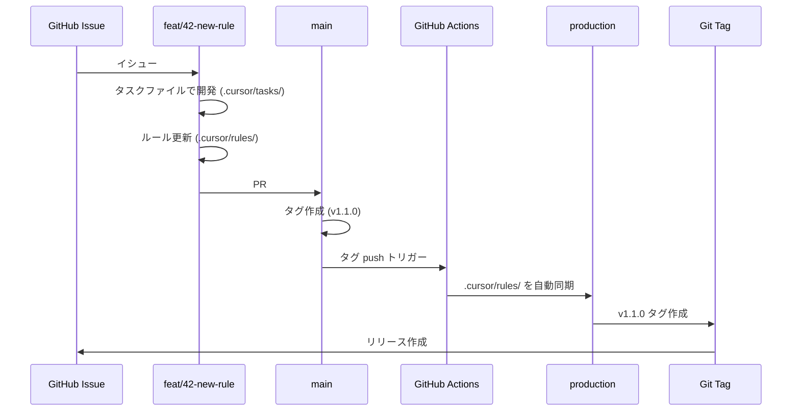

# ブランチ戦略による cursor-rules 統合

submodule を廃止し、1つのリポジトリで開発用ブランチと公開用ブランチを分けることで、cursor-workspace と cursor-rules を統合します。

## Completed Tasks

- [x] ネット調査: ブランチ戦略のベストプラクティスを確認
- [x] タスクファイル作成
- [x] Mermaid 図をファイルに出力（シンタックスエラーの原因を調査）

## In Progress Tasks

- [ ] orphan ブランチ `production` を作成
- [ ] `main` ブランチから submodule を削除し、`.cursor/rules/` を直接管理
- [ ] GitHub Actions ワークフロー作成（タグ作成時の自動同期）
- [ ] ブランチ戦略のドキュメント作成（`.cursor/rules/git/branch-strategy.mdc`）
- [ ] README.md を更新（新しいブランチ戦略を反映）

## Future Tasks

- [ ] 動作確認: タグ作成 → production への自動同期
- [ ] 既存の worktree で問題がないか確認
- [ ] cursor-rules リポジトリを archive または削除（統合完了後）

## Implementation Plan

### 目標

1. **cursor-workspace と cursor-rules を1つのリポジトリに統合**
2. **開発用ブランチ（main）と公開用ブランチ（production）で管理**
3. **GitHub Actions でタグ作成時に自動同期**
4. **submodule を完全に廃止**

### 要件・制約事項

- **公開用ブランチ名**: `production`（ユーザー希望）
- **開発用ブランチ名**: `main`（現状維持、GitLab Flow に沿う）
- **GitHub Actions**: タグ作成時（`v*`）に自動同期
- **開発中のタスクファイル**: Git 管理したいが、本番には含めない
- **ブランチ戦略**: 一般的なパターン（GitLab Flow / gh-pages パターン）を採用

### 検討事項・議論ログ

#### ブランチ命名の検討

**候補案:**
- A: `production` + `develop`
- B: `production` + `main`（採用）
- C: `public` + `develop`
- D: `public` + `main`

**採用理由:**
- `production`: 公開/配布用という意図が明確（ユーザー希望）
- `main`: 現在のブランチをそのまま使える、GitLab Flow に沿う、GitHub のデフォルトブランチ

#### ネット調査の結果

**このパターンは「特殊」ではなく、一般的：**

1. **GitLab Flow パターン**（最も近い）
   - `main` (開発ベース) → `production` (本番環境/配布用)
   - 環境ごとにブランチを用意する戦略
   - CI/CD での継続的デリバリーに最適

2. **gh-pages パターン**（類似）
   - `main` (ソース) → `gh-pages` (ビルド成果物)
   - GitHub Pages でよく使われる

3. **Git Flow**（伝統的）
   - `develop` (開発) → `main` (本番)
   - ただし現代では `main` を開発ブランチにすることも一般的

**結論:** GitLab Flow の一種として、`main` (開発) + `production` (公開) は妥当

#### 同期方法の検討

**候補:**
- A: 手動 cherry-pick
- B: git subtree split（自動だが履歴が複雑）
- C: orphan ブランチ + GitHub Actions（採用）

**採用理由:**
- orphan ブランチ: 完全に独立した履歴で、production は軽量
- GitHub Actions: タグ作成時に `.cursor/rules/` のみを自動同期
- シンプルで理解しやすい、運用コストが低い

### 決定事項

1. **ブランチ構成**
   - `main`: 開発用（すべてのファイルを含む）
   - `production`: 公開用（`.cursor/rules/` のみ、orphan ブランチ）

2. **GitHub Actions**
   - `main` で `v*` タグ作成時に自動で `production` に同期
   - ワークフロー名: `.github/workflows/sync-production.yml`

3. **submodule 廃止**
   - `.cursor/rules/` を通常のディレクトリとして管理
   - `.gitmodules` を削除

4. **バージョン管理**
   - `production` ブランチで Git タグを付与（`v1.0.0` など）

### アーキテクチャ

#### ブランチ構成図（Mermaid）

```mermaid
%%{init: {'theme':'base', 'themeVariables': { 'commitLabelFontSize': '12px'}}}%%
gitGraph
    commit id: "init"
    branch production
    checkout production
    commit id: "公開用: rules/ のみ" tag: "v1.0.0"
    
    checkout main
    commit id: "開発: rules/ + tasks/ + README"
    
    branch feat/42-new-rule
    checkout feat/42-new-rule
    commit id: "新ルール実装中"
    commit id: "タスク完了"
    
    checkout main
    merge feat/42-new-rule id: "PR #42 マージ"
    commit id: "rules/ を更新"
    
    checkout production
    cherry-pick id: "rules/ の変更のみ取り込み" tag: "v1.1.0"
    
    checkout main
    branch feat/43-workflow
    commit id: "ワークフロー改善"
    
    checkout main
    merge feat/43-workflow
```

#### ワークフロー図（Mermaid）



#### ディレクトリ構成

**main ブランチ:**
```
main/
  .cursor/
    rules/         # ルールファイル（通常のディレクトリとして管理）
      global.mdc
      cursor-tasks.mdc
      git/
        commit.mdc
        issue.mdc
        pr.mdc
        worktree.mdc
        branch-strategy.mdc  # 新規作成
    tasks/         # タスクファイル（開発用、本番には含めない）
      CHORE-37_branch-strategy.md
      ...
  .github/
    workflows/
      sync-production.yml  # 新規作成
  README.md
  SETUP_SHARED_RULES.md  # 更新（submodule から orphan ブランチに変更）
```

**production ブランチ:**
```
production/
  rules/           # .cursor/rules/ の内容をコピー
    global.mdc
    cursor-tasks.mdc
    git/
      commit.mdc
      issue.mdc
      pr.mdc
      worktree.mdc
      branch-strategy.mdc
  README.md        # cursor-rules 用の README
  LICENSE
```

### データフロー

#### 開発フロー

1. **feature ブランチで開発**
   ```bash
   git checkout main
   git checkout -b feat/42-new-rule
   # .cursor/tasks/FEAT-42_new-rule.md で進捗管理
   # .cursor/rules/ を編集
   git commit -m "feat: 新しいルールを追加"
   ```

2. **main にマージ**
   ```bash
   git push origin feat/42-new-rule
   # PR を作成してマージ
   ```

3. **タグを作成（リリース準備完了時）**
   ```bash
   git checkout main
   git pull
   git tag v1.1.0
   git push origin v1.1.0
   ```

4. **GitHub Actions が自動実行**
   - `.cursor/rules/` の内容を `production` ブランチに同期
   - `production` ブランチで `v1.1.0` タグを作成
   - GitHub Release を作成

#### GitHub Actions ワークフロー（概要）

```yaml
name: Sync to production

on:
  push:
    tags:
      - 'v*'

jobs:
  sync:
    runs-on: ubuntu-latest
    steps:
      - uses: actions/checkout@v4
        with:
          fetch-depth: 0
      
      - name: Sync .cursor/rules/ to production
        run: |
          git checkout production
          git checkout main -- .cursor/rules/
          mv .cursor/rules/* .
          git add .
          git commit -m "chore: sync from main ${GITHUB_REF_NAME}"
          git tag ${GITHUB_REF_NAME}
          git push origin production --tags
```

### その他

#### Mermaid のシンタックスエラーについて

- Mermaid 図は `.cursor/tasks/ref/` に参照ファイルとして出力
- GitHub で正しくレンダリングされるか確認
- エラーの原因を調査（日本語コメント、特殊文字、構文エラーなど）

#### 実装の優先順位

1. Mermaid 図の出力とエラー調査
2. orphan ブランチ `production` の作成
3. submodule の削除と `.cursor/rules/` の直接管理
4. GitHub Actions ワークフロー作成
5. ドキュメント整備

## Relevant Files

- `.cursor/tasks/CHORE-37_branch-strategy.md` - このタスクファイル ✅
- `.cursor/tasks/ref/ref-CHORE-37_mermaid-diagrams.md` - Mermaid 図とシンタックスエラー調査 ✅
- `.github/workflows/sync-production.yml` - GitHub Actions ワークフロー（新規作成予定）
- `.cursor/rules/git/branch-strategy.mdc` - ブランチ戦略のドキュメント（新規作成予定）
- `README.md` - 更新予定
- `SETUP_SHARED_RULES.md` - 更新予定（submodule → orphan ブランチ）

