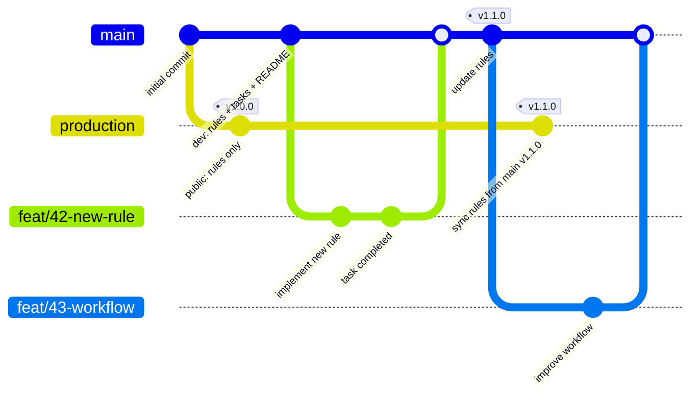
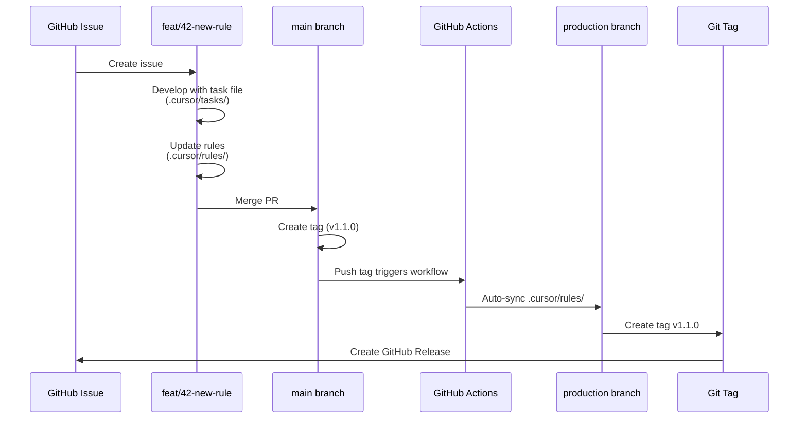
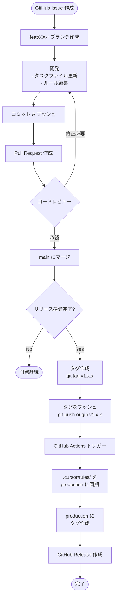
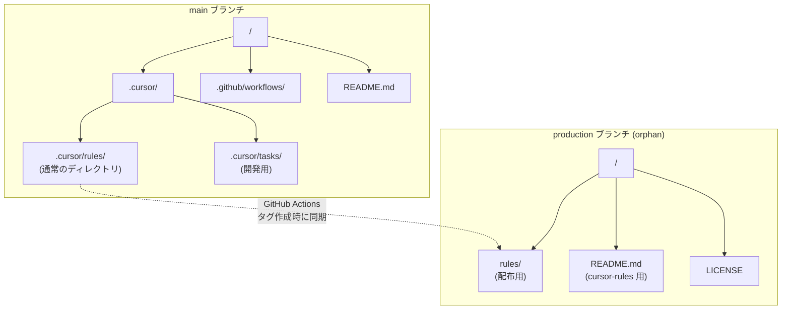

# Mermaid 図: ブランチ戦略とワークフロー

このファイルは、CHORE-37 のブランチ戦略を視覚化するための Mermaid 図を含みます。

## ブランチ構成図（Git Graph）



### 説明

- `main`: 開発用ブランチ（すべてのファイルを含む）
- `production`: 公開用ブランチ（`.cursor/rules/` のみ、orphan ブランチ）
- `feat/*`: 機能開発ブランチ（`main` から分岐）
- タグ: `production` ブランチでバージョン管理（`v1.0.0`, `v1.1.0` など）

---

## ワークフロー図（Sequence Diagram）



### 説明

1. GitHub でイシュー作成
2. feature ブランチで開発（タスクファイルで進捗管理）
3. main にマージ
4. タグ作成（`v1.1.0`）
5. GitHub Actions が自動実行
6. production ブランチに同期
7. リリース作成

---

## 通常の開発フロー図（Flowchart）



---

## ディレクトリ構成図（Graph）



### 説明

- **main ブランチ**: 開発用、すべてのファイルを含む
- **production ブランチ**: 公開用、`.cursor/rules/` の内容のみ（orphan ブランチ）
- GitHub Actions でタグ作成時に自動同期

---

## Mermaid シンタックスエラーの調査

### 可能性のある原因

1. **日本語コメント**: Mermaid は日本語をサポートしているが、レンダラーによっては問題が起こる
2. **特殊文字**: `#`, `*`, `-` などがコンフリクトする可能性
3. **改行と空白**: インデントや改行の扱いが厳密
4. **Mermaid バージョン**: GitHub と Cursor で使用しているバージョンが異なる可能性
5. **テーマ設定**: `%%{init:...}%%` の構文が正しくない可能性

### エラー修正: cherry-pick の問題

**エラー内容:**
```
"Incorrect usage of "cherryPick" Source commit id should exist and provided"
```

**原因:**
Mermaid の gitGraph では `cherry-pick` の構文が制限されており、存在するコミット ID を参照する必要があります。しかし、ブランチ間で独立した履歴（orphan ブランチ）の場合、cherry-pick を直接表現できません。

**修正:**
cherry-pick を使わず、通常の commit で「同期」を表現します。実際の運用では GitHub Actions が自動的にファイルをコピーするため、Git 的には新しいコミットとして扱われます。

### GitHub での確認方法

このファイルを GitHub にプッシュして、正しくレンダリングされるか確認してください：

```bash
git add .cursor/tasks/ref/ref-CHORE-37_mermaid-diagrams.md
git commit -m "docs: Mermaid diagrams for branch strategy"
git push
```

GitHub の Web UI で `.cursor/tasks/ref/ref-CHORE-37_mermaid-diagrams.md` を開き、図が表示されるか確認してください。

