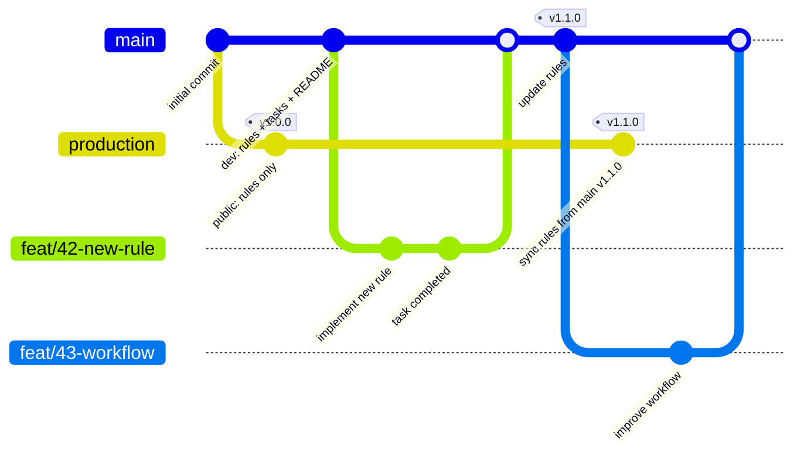

# ブランチ戦略: production / main 構成

このリポジトリは、開発用ブランチと公開用ブランチを分けて管理しています。

## ブランチ構成

### `main` ブランチ（開発用）

- **用途**: 開発のベースブランチ
- **含まれるもの**: `.cursor/rules/`（ルールファイル）、`.cursor/tasks/`（タスクファイル）、README、GitHub Actions など
- **運用**: 
  - feature ブランチはここから分岐
  - GitHub のデフォルトブランチ
  - clone すると開発環境が手に入る

### `production` ブランチ（公開用）

- **用途**: cursor-rules として公開・配布
- **含まれるもの**: `rules/`（main の `.cursor/rules/` と同期）、README.md、LICENSE
- **特徴**:
  - orphan ブランチ（`main` とは完全に独立した履歴）
  - Git タグでバージョン管理（`v1.0.0`, `v1.1.0` など）
  - タスクファイルや開発用ファイルは含まない

**ディレクトリ構成:**
```
production/
  rules/
    cursor-tasks.mdc
    global.mdc
    git/
      commit.mdc
      issue.mdc
      pr.mdc
      worktree.mdc
  README.md
  LICENSE
```

> **Note**: production ブランチの README.md と LICENSE は、配布先での使い方説明と法的保護のために必要です。

## ブランチ構成図（Git Graph）



## ワークフロー

### 通常の開発

```bash
# 1. main から feature ブランチを作成
git checkout main
git checkout -b feat/42-new-rule

# 2. 開発（タスクファイルで進捗管理）
# .cursor/tasks/FEAT-42_new-rule.md
# .cursor/rules/ を編集

# 3. コミット & プッシュ
git add .
git commit -m "feat: 新しいルールを追加"
git push origin feat/42-new-rule

# 4. PR を作成してマージ
gh pr create --base main --head feat/42-new-rule
gh pr merge 42
```

### リリース（production への同期）

```bash
# 1. main で開発が完了したらタグを作成
git checkout main
git pull
git tag v1.1.0
git push origin v1.1.0

# 2. GitHub Actions が自動的に production に同期
```

GitHub Actions が以下を自動実行：
1. `.cursor/rules/` の内容を production ブランチに同期
2. production ブランチで同じタグ（`v1.1.0`）を作成
3. GitHub Release を作成

詳細: [`.github/workflows/sync-production.yml`](../.github/workflows/sync-production.yml)

## ブランチ戦略の背景

このパターンは **GitLab Flow** の一種で、環境ごとにブランチを分ける一般的な戦略です。

### 類似パターン

- **GitLab Flow**: `main` (開発) → `production` (本番環境)
- **gh-pages パターン**: `main` (ソース) → `gh-pages` (ビルド成果物)

### なぜ orphan ブランチを使うのか

1. **履歴の分離**: 開発用と公開用で完全に独立した履歴を持つ
2. **軽量化**: production ブランチには公開に必要な最小限のファイルのみ
3. **明確な役割分担**: 開発環境と配布物を明確に区別

## 参考資料

- [GitLab Flow](https://docs.gitlab.com/ee/topics/gitlab_flow.html)
- [Git Branching Strategies](https://www.atlassian.com/git/tutorials/comparing-workflows)
- [GitHub Actions](https://docs.github.com/ja/actions)
